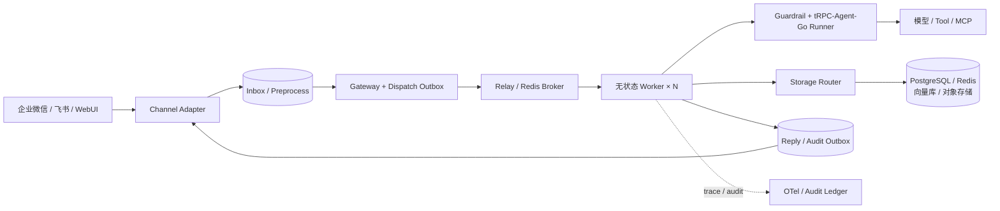
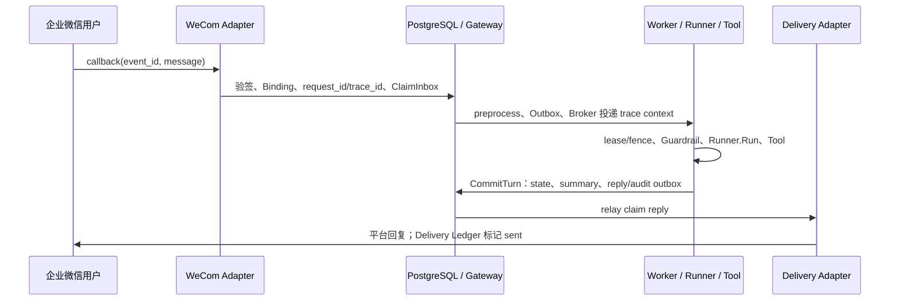

# trpc-agent-service 交付架构总览

> 本文面向验收、汇报和代码评审，只陈述已实现能力与已验证边界。字段、状态机和接口以 [`docs/design/`](./design/README.md) 为准；可执行交付边界为 Docker Desktop。

## 1. 目标与总体架构

`trpc-agent-service` 建立在 tRPC-Agent-Go 公共 API 之上。Gateway、Worker 与 IM Adapter 可独立扩缩；权威状态位于 PostgreSQL，Redis 只负责队列、租约、fence 和协调，因此 Worker 无需 sticky session。

控制面管理 Tenant、Agent App Revision、模型/后端 Profile、工具权限、Channel Binding 和审计策略。执行固定 `tenant_id`、app、policy 与 backend 的版本快照，发布或回滚只影响后续请求。

## 2. 多租户、会话和数据模型

可信 `TenantContext` 只能来自认证 HTTP 身份或验签成功的 Channel Binding；Gateway、Worker、Storage Router 和审计入口均复核 tenant scope。模型、IM、数据库密钥仅以 `SecretRef` 引用，日志、trace 和审计均脱敏。

核心关系是 `tenant → agent_app → revision`，以及 `tenant + channel_binding → external_user/conversation → session → event、summary、memory`。每条入站消息对应唯一 `inbox/execution_record`，回复与审计进入 `delivery_ledger/reply_outbox` 和 `audit_log`；群聊 session 加入群标识，因此跨群、跨租户均不共享。

完整 DDL、ER 图和状态约束见详细设计。

## 3. 多后端与一致性策略

PostgreSQL 存强一致控制面、Session、事件、Inbox/Outbox 与审计；Redis 存 broker、lease/fence；向量库或外部 Memory 服务存知识/记忆索引；对象存储存 Artifact、图片和文件。`Storage Router` 按租户 Binding 路由。

并发 session 由 lease/fence 串行化，提交由 PostgreSQL 事务/CAS 保证。`CommitTurn` 原子写结果和 outbox；`ClaimInbox` 与 Delivery Ledger 保证入口和 IM 回复效果幂等。派生数据按版本/水位对账；Redis→SQL、Local Vector→Remote Vector 按 snapshot、dual-write、backfill、verify、cutover 迁移。

## 4. IM 接入与端到端时序

飞书和企业微信 Adapter 负责验签/解密、去重、身份映射、群聊规则和平台回复，再归一为内部消息。文本、图片和文件经大小/类型校验、ClamAV 和租户隔离暂存后形成 `model.Message`。本地已验证飞书单聊/群聊/图片与企业微信文本/图片；未支持的流式/卡片安全降级为最终文本。

`request_id`、W3C `traceparent` 与 tenant/app/session 属性贯穿 callback、broker、Runner、Tool、存储、审计和回复，可在 Jaeger 与审计账本还原链路。Channel 契约和限制见 [`4.channel-governance-security-design.md`](./design/4.channel-governance-security-design.md)。

## 5. 治理、运维与风险控制

Worker 内嵌不可绕过的 Governance/Filter Chain：校验 tenant、用户、模型/工具白名单、DLP、预算和危险确认。OpenTelemetry 覆盖 callback、Runner、Tool、存储与 delivery；审计记录 tenant、channel、user、session、agent、tool、decision、latency、error、cost 和 trace ID。

| 风险 | 缓解措施 |
| --- | --- |
| Worker 崩溃 | lease 过期接管与 fence 拒绝旧 owner 提交。 |
| PostgreSQL 短断 | 未 durable 的 callback 不 ACK；事务整体回滚并由 reconciler 恢复。 |
| Redis/Broker 故障 | Outbox 积压、有界退避，恢复后幂等重放。 |
| 模型超时 | 有界重试；仅在租户策略允许时切备用模型，否则显式失败。 |
| 工具副作用不确定 | 区分幂等与非幂等工具；ambiguous 结果不盲目重放。 |
| IM 重复、乱序、429 | Inbox/Delivery Ledger 幂等键、顺序约束和 retry-after。 |
| 租户越权或密钥泄漏 | 多层 tenant 校验、SecretRef、日志/trace 脱敏和 fail-closed。 |
| 审计或遥测故障 | 审计 Outbox 可重放；非关键 telemetry 有界丢弃且独立告警。 |

Gateway、Worker、Relay 和 Adapter 可独立部署，Worker 无需 sticky session。租户灰度使用不可变快照与 active pointer；回滚以新版本 copy-forward。容量输入包括活跃 session、token、Redis/SQL QPS、积压、IM 峰值和模型并发；仓库只给出 Docker 本地验证。

## 6. tRPC-Agent-Go 复用边界与验收

服务复用 tRPC-Agent-Go 的 Runner、Agent、Session/Memory/Knowledge/Artifact、Tool/MCP、Plugin/Guardrail/Callback 与协议公共 API。平台新增可信租户控制面、Profile/Secret 路由、Inbox/Outbox/relay、lease/fence、IM Adapter、治理装配与审计；不依赖上游 `internal` 包。OpenClaw Channel 的 `ID/Run` 生命周期和 sender 语义由服务 Adapter 兼容扩展。

本地 Docker 的命令、资源与成功证据见 [`runbook/verification-matrix.md`](./runbook/verification-matrix.md)；详细规范见 [`design/`](./design/README.md)。
