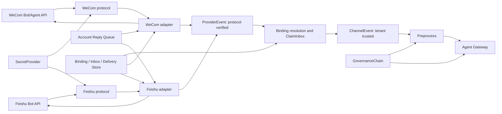
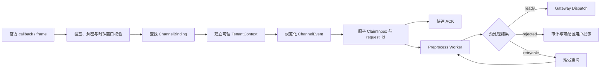
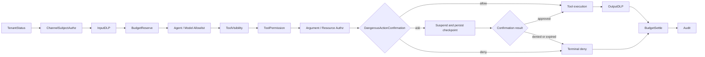
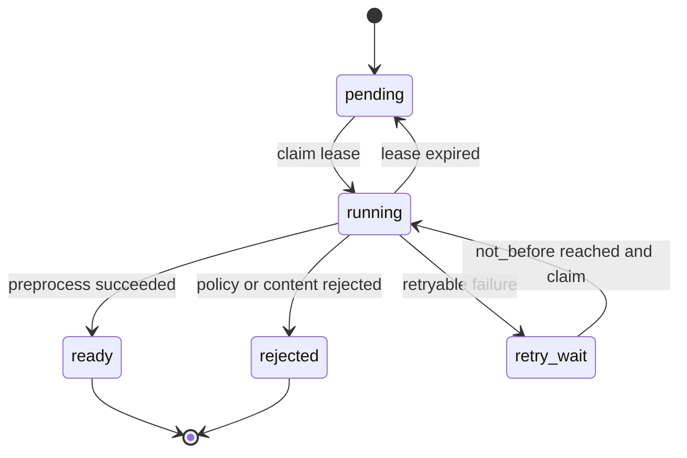
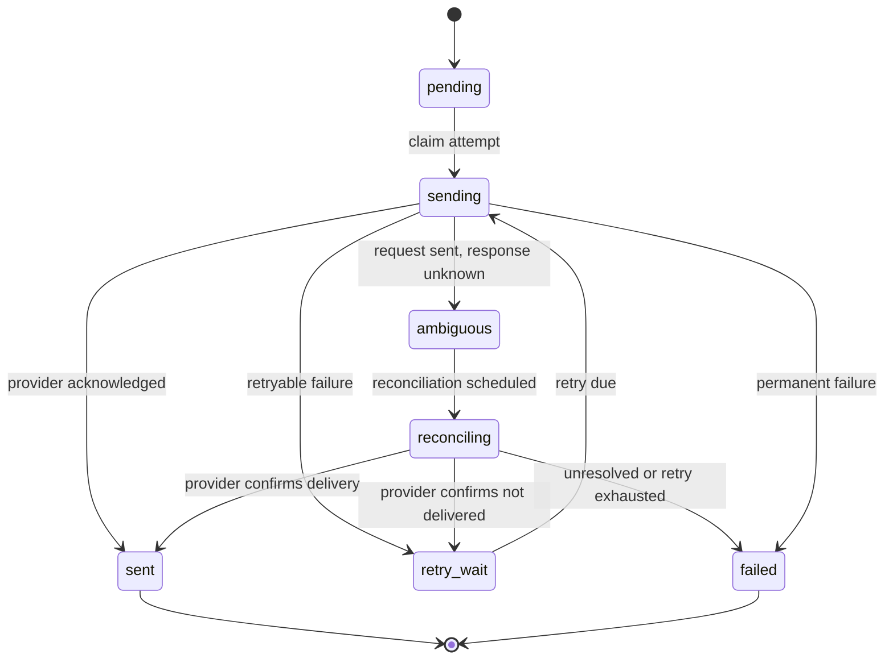
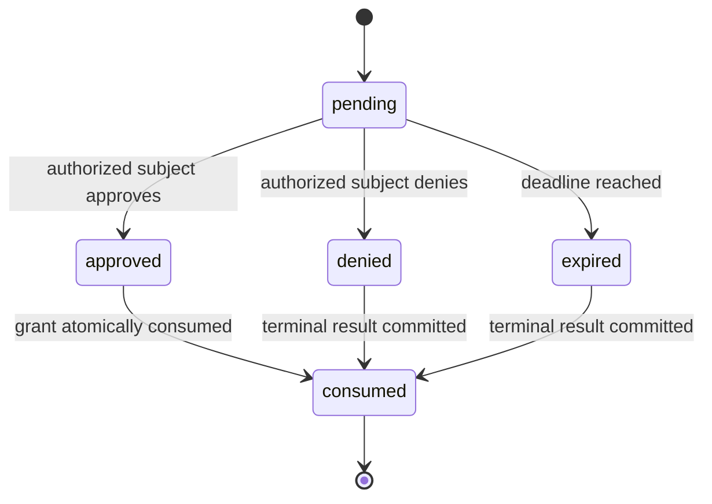

# C 模块：IM Channel、租户治理与安全技术方案

| 文档属性 | 内容 |
|---|---|
| 设计状态 | 实施基线 |
| 模块范围 | WeCom/Feishu Channel Provider、Preprocess、Governance、Confirmation、Secret 与 Redaction |
| 上游依赖 | B 模块 Binding、Inbox、Delivery Ledger、Artifact 与 Outbox 契约 |
| 下游协作 | A 模块 Gateway/Runtime，D 模块 Trace、Audit 与安全告警 |
| 总体架构 | [总体技术方案（第 13 节）](0.architecture.md) |

## 0. 阅读与落地指南

本模块回答两个相邻但不同的问题：**如何把 WeCom/Feishu 的不可信协议事件可靠转换为租户内请求并送回回复，以及如何在 Agent/Tool 执行前后实施不可绕过的租户治理。**

### 0.1 三条职责线

| 职责线 | 输入 | 输出 | 自有状态 | 关键边界 |
|---|---|---|---|---|
| Channel ingress | 官方 callback/WSS frame | durable `ChannelEvent` / ignored terminal | Binding 解析结果、协议连接状态 | 完成协议校验和 ClaimInbox 后才能 ACK |
| Preprocess 与 delivery | payload/media ref、`ReplyEvent` | ready/rejected input、IM 消息 | Preprocess job、Delivery Ledger、`connection_lease` | 不运行 Agent，不修改 Session |
| Governance 与 security | TenantContext、固定 PolicySnapshot、tool call | allow/deny/ask/redact、Audit intent | reservation、confirmation、grant、redaction policy | Adapter 不做业务授权；裸 Tool 不可绕过最终 Guard |

三条线共享 TenantContext、Binding、SecretProvider、AuditEmitter 和 typed storage ports，但不共享状态机：Preprocess claim lease、Channel `connection_lease`、A 的 session lease/fence 必须使用不同名称、key 和恢复规则。

### 0.2 两条主链路

入站与回复：

```text
WeCom/Feishu event
→ protocol verify/decode
→ Binding resolution + trusted TenantContext
→ ClaimInbox + durable ACK
→ Preprocess
→ A.PrepareDispatch / Worker / CommitTurn
→ Reply Outbox
→ account reply queue
→ Adapter render/split/rate-limit
→ Delivery Ledger
→ IM API
```

治理与确认：

```text
fixed PolicySnapshot
→ subject/input/budget/model/tool checks
→ allow: guarded execution
→ deny: terminal result
→ ask: durable suspension + confirmation
→ one-time grant + A continuation
→ output DLP + budget settle + audit
```

### 0.3 状态所有权速查

| 状态 | 权威模块 | C 的动作 |
|---|---|---|
| Inbox、Reply Outbox、Delivery Ledger | B | 通过 typed port claim/finish，不直写表 |
| Session、`input_seq`、fence、Park/Wakeup | A/B | 生成规范化 session identity；不实现执行协调 |
| App Revision/Config/Policy 版本 | Tenant/B | 透传固定 ExecutionBinding，不解析 current/latest |
| Provider connection/frame/token cache | C | 按 Binding + credential generation 管理 |
| Confirmation/grant/policy decision | C 语义、B 持久化 | 评价、持久化请求、授权主体校验、一次性消费 |
| Trace/metric/audit export | D | 产生上下文、指标和 Audit intent，不直接替代 Audit Outbox |

### 0.4 建议阅读路径

| 读者目标 | 先读 | 再读 |
|---|---|---|
| 实现公共 Channel | §1–4、§7 | §11–12、§16 |
| 实现 WeCom | §5、§7.2 | §13、§16、§19 |
| 实现 Feishu | §6–7 | §14、§16、§19 |
| 实现治理/确认 | §8–10 | §17–18、§19 |
| 排查重复、权限或 secret | §3–4、§7、§10 | §15–19 |

## 1. 设计目标与职责边界

Channel Framework 提供协议无关的入站、出站、Binding、能力发现和生命周期契约。WeCom 与 Feishu Adapter 是平级实现；新增协议只增加 provider package，不修改 Gateway、Worker 或 Session 语义。

Adapter 负责官方协议、身份规范化和投递，不运行 Agent；Gateway/Worker 只认识 `ChannelEvent` 和 `ReplyEvent`，不得 import 平台 DTO。

### 1.1 模块分层与依赖关系



`protocol` 层只实现官方协议；`adapter` 层完成平台对象与公共契约的转换；公共 Preprocess、Governance 和 Delivery 能力不得复制到单一 Provider 内部。

## 2. 公共接口

```go
type Adapter interface {
    ID() string
    Run(context.Context) error
    Verify(context.Context, CallbackRequest) error
    Decode(context.Context, CallbackRequest) ([]ProviderEvent, error)
    Deliver(context.Context, DeliveryRequest) (DeliveryResult, error)
    Capabilities() Capabilities
}

// ProviderEvent is protocol-normalized but is not yet tenant-trusted.
type ProviderEvent struct {
    SchemaVersion uint16
    Channel, ExternalAccountID, ExternalMessageID string
    ConversationType string
    ExternalUserID, ExternalChatID string
    MessageType string
    Text string
    MediaRefs []MediaRef
    OccurredAt time.Time
    TraceParent string
}

// ChannelEvent is created only after Binding resolution and durable ClaimInbox.
type ChannelEvent struct {
    SchemaVersion uint16
    TenantID, AgentAppID, ChannelBindingID string
    RequestID, UserID, SessionID string
    Channel, ExternalMessageID, MessageType string
    Text string
    MediaRefs []MediaRef
    PayloadRef string
    TraceParent string
}

type ReplyEvent struct {
    SchemaVersion uint16
    TenantID, RequestID, ChannelBindingID, DeliveryKey string
    EventSeq uint64
    Kind string
    ContentRef string
    Final bool
    TraceParent string
}
```

`ProviderEvent` 只表示通过协议校验的平台事实，不构成可信 `TenantContext`。Adapter 必须先依据服务端 Binding 建立租户作用域并完成 durable ClaimInbox，才能创建 `ChannelEvent`；Gateway 仅接收后者，并再次从共享存储复核 request 与 tenant/app 绑定。

Capabilities 表示 text、stream/edit、markdown、card、image、file、recall 等可选能力。公共接口不要求所有平台实现相同能力集合，调用方必须依据能力协商结果选择投递方式或降级策略。

## 3. 固定处理链



大媒体下载、病毒扫描、完整 Input DLP 和格式转换在 ACK 后运行。Preprocess 状态固定为 `pending/running/ready/rejected/retry_wait`，使用独立 claim lease；它不是 session lease，也不产生 session fence。rejected 不分配 input_seq，也不进入用户可见 Session 历史，但写审计和可配置的用户提示。

## 4. Binding、去重与 session

`ChannelBinding` 唯一绑定 `(channel, external_account_id)` 到一个 tenant/app，包含 transport 配置和 SecretRef。找不到、重复绑定或密钥版本不可用时 fail closed。tenant 为 suspended/disabled 时仍可 durable claim 回调以完成去重和安全 ACK，但必须生成非执行终态，不能进入 PrepareDispatch；disabled 不再发送普通业务回复。状态边界以 [Tenant 根实体文档（第一部分第 6 节）](1.tenant-root-design.md) 为准。

入站幂等键优先使用平台稳定消息 ID；没有稳定 ID 时使用账号、会话、主体、时间桶和规范化 payload digest，并记录碰撞指标。

DM/group session ID 按总体架构的 tenant HMAC 规则生成，canonical input 必须包含 channel、外部账号 scope、会话类型和外部 user/chat ID，并使用 SecretProvider 提供的版本化 tenant identity/session key。无密钥 SHA-256 不能替代该规则；SHA-256 只可用于非敏感内容摘要或幂等键。外部用户映射表带 tenant、channel、account scope；跨群共享只能进入租户 Memory，不能共享 Session。

Adapter 只携带 `PrepareDispatch` 固定的 `tenant_id + agent_app_id + agent_app_revision + content_digest + config_version + policy_version`，不引入 `agent_version` 或 `published_version`。session fence 校准和乱序 Park/Wakeup 复用 A 的 coordination/input gate 与 B 的持久状态契约；C 的 `connection_lease` 只管理通道连接。Session 后端由 tenant/app 的 BackendBinding 选择，而不是按 IM channel 硬编码；演示租户使用不同后端只用于验证适配与迁移路径。多 Worker 下，后端仍须满足 `AtomicTurnCommit`、stale fence、CAS 和 tenant scope contract。

## 5. WeCom Adapter

- 企业微信协议直接遵循官方 Bot/Agent API、签名、AES、access token、媒体和消息接口。
- Bot WebSocket、Bot Webhook 和 Agent XML callback 可以作为不同 transport，共享 ChannelEvent/ReplyEvent。
- WebSocket 同一账号使用 `connection_lease` 保证单 owner；该名称和 session fence 明确分离。
- 回调在验签、解密和 durable ClaimInbox 后快速 ACK。
- access token 按 corp/app/credential version 共享缓存并提前刷新；401/失效只允许有界刷新重试。
- 使用官方 golden vectors 验证签名、AES、receive-id 和 XML/JSON 编解码。

## 6. Feishu Adapter

- 长连接或 callback transport 共享同一 normalize/delivery contract；`header.event_id` 作为 Inbox 稳定去重 ID，`message.message_id` 只用于回复定位，二者不得混用。
- Binding ready 时通过 Bot Info 获取并缓存机器人自身 OpenID；缓存键必须包含 binding 与 credential version，凭据轮换后重新解析，失败则群聊入口 fail closed。
- 协议层把 `message.mentions[]` 的 `key`、`id.open_id`、`tenant_key` 与 `message.content` 中对应 placeholder 解析为带 span 的 `Mention`，并把平台定义的 everyone mention 归一为独立 `MentionAll`；禁止根据显示名或对原始文本做全局字符串替换。
- p2p 总是进入后续门禁。group 仅在 mentions 中存在 `id.open_id == bot_open_id` 时处理；单独 `@其他成员` 或 `@所有人` 不触发执行。
- 混合 mention 中只删除机器人自身 placeholder；其他成员与 everyone mention 保留为规范化可见文本。只要存在自身 mention 就处理剩余正文；删除后正文为空则 durable ACK 为 ignored，不调用 Agent。
- Reply API 使用 `message.message_id` 定位，并以 C 透传的稳定 `delivery_key` 派生 API UUID；同一逻辑回复重投必须复用 UUID。

## 7. 回复与 Delivery Ledger

Reply Relay 只把 ReplyEvent 路由到 binding/account 队列；Adapter owner 负责真实 API 调用。Delivery Ledger 唯一键为 `(tenant_id, delivery_key, segment_no)`，状态为 pending/sending/sent/ambiguous/failed。

`ReplyEvent.DeliveryKey` 固定等于 B 模块确定性生成的 `reply_id`。C 不得再按 Worker、重试次数或随机 UUID 改写它；renderer/format version 和分片计划在首次 claim 时写入 Delivery Ledger，后续重投复用同一计划。

- sent 重投直接 ACK，不重复发送。
- 429 按官方 retry-after 调度。
- 5xx/网络失败有界退避。
- 请求已发出但响应丢失标记 ambiguous；先查询平台能力或等待对账，不能盲目重发。
- IM 投递失败只重试 Reply，不重跑 Agent。

### 7.1 流式回复与 SSE 降级语义

Channel Framework 统一处理逻辑 ReplyEvent，但按 Provider capability 选择交付形式：WeCom stream/卡片/分片、Feishu reply/edit、HTTP SSE 或非流式终态回复。流式传输不是事实存储：

- `run.started/progress/message.delta` 属于可丢弃体验事件，使用有界非阻塞缓冲；慢消费者不得反压 Runner、CommitTurn 或 Relay。
- `message.completed/run.completed/run.failed/run.denied` 属于终态通知，必须由已提交的 session result/Reply Outbox 派生并优先投递，不能只存在进程内 Hub。
- Gateway 与 Worker 分离或水平扩展时，实时 fan-out 使用共享 EventBus；Pub/Sub 只负责唤醒和低延迟分发，完整回放按 tenant/request/cursor 从持久 event/result store 读取。
- 客户端断开只取消该订阅；是否取消 Agent 必须调用显式 cancel API 并写共享 cancel intent，不能把 SSE TCP 断开等同于业务取消。
- delta 丢失时客户端从最后确认 cursor 获取终态或持久事件，不要求 sticky session。

### 7.2 WeCom 流式回复与主动消息降级

WeCom WebSocket transport 将同一逻辑回复串行化到 binding/account + conversation 队列。`ReplyStream` delta 先按 UTF-8/Markdown 边界聚合；账号级 token bucket、会话最小发送间隔和平台 429/频控响应共同决定刷新频率，配置不得高于平台限制。高频 token 只更新内存中的待发送聚合，不逐 token 调用平台。

Delivery Ledger 除公共状态外保存 `connection_generation`、`req_id/frame` 到期时间、`accepted_cursor` 和 `finish_accepted`。降级规则固定为：

1. 尚无任何 stream frame 被平台接受，且 frame 已过期、连接 generation 改变或平台明确返回不可继续回复时，可发送一条完整主动消息。
2. 已有前缀被确认可见时，先结束或放弃旧 stream，再按 `accepted_cursor` 发送带“续接”标识的剩余后缀；不得重新发送完整答案。
3. 平台是否接受上一帧不确定时标记 `ambiguous`，优先查询/对账；不能盲目切主动消息，否则可能产生重复和乱序。
4. `finish` 成功后禁止主动消息降级；所有主动分片沿用同一 `delivery_key` 并递增 `segment_no`，只能由账号队列按序发送。

主动消息所需的 transport-specific BotID/Secret 或 corp/app 凭据和 scope 由 Binding 的 SecretRef 与 capability check 管理，只有 Adapter owner 可解析；Worker、ReplyEvent 和日志不携带明文。Binding 启动及凭据轮换时验证发送权限，权限缺失将 binding 标为 unhealthy，而不是等到流式失败后静默丢消息。

## 8. GovernanceChain

PolicySnapshot 在请求入队时固定版本，Worker 执行前复核。治理阶段及其顺序属于公共契约：



平台安全 Filter 不允许 Agent 删除、重排或 short-circuit。工具白名单既影响模型可见列表，也在实际执行前再次校验，防止动态/子 Agent 绕过。

### 8.1 上游工具权限原语映射

service 不重新实现一套 Tool 执行框架，而是把固定 PolicySnapshot 编译为核心 `trpc-agent-go/agent` 的 per-run RunOption：

| Governance 阶段 | 上游原语 | service 侧职责 |
|---|---|---|
| ToolVisibility | `agent.WithToolFilter` | 从 tenant/app 白名单生成可见性谓词 |
| ToolPermission | `agent.WithToolPermissionPolicy` 或 `WithToolPermissionPolicyFunc` | 在参数修复和 before-tool callback 后，以最终参数执行 tenant/subject/tool 策略 |
| DangerousAction routing | `agent.WithToolExecutionFilter` | 对需异步确认或外部执行的工具返回 false，使 Runner 在 assistant tool_call 后停止自动执行并交还 service |
| Model selection | `agent.WithModel`/`WithModelName` | 只注入 ExecutionProfile 允许的固定模型 |

`WithToolFilter` 是可见性软约束，且上游 framework tools 不受它过滤，不能作为安全边界。所有实际执行仍必须通过 `WithToolPermissionPolicy`、资源级授权和工具自身不可绕过的检查；动态 Agent、子 Agent 和 framework tool 必须运行相同 contract suite。`WithToolExecutionFilter=false` 不是 deny，而是把带参数的 tool call 转交 service 的 confirmation/external-tool 编排，不能直接丢弃。

`WithToolExecutionFilter` 的谓词只接收 Tool，不接收最终参数。因此，只要某工具的确认要求可能依赖参数或资源，该工具在本次运行中必须始终走 caller-executed 路径；service 收到最终 tool_call 参数后复用同一 PolicySnapshot evaluator 执行参数/资源授权，再决定 allow、deny 或 durable ask。不得尝试在该 Filter 中做参数级授权，也不得假设被转交的工具已经通过 `WithToolPermissionPolicy`。

上游 Filter/PermissionPolicy 之外必须再有不可绕过的最终执行层 Guard。Tool Registry 向 Agent、动态/子 Agent、framework tool 和 caller-executed continuation 暴露的只能是 tenant-scoped wrapper；wrapper 在真正调用底层 Tool 前重新要求可信 TenantContext、request/tool-call ID、固定 PolicySnapshot、规范化最终参数和资源授权结果。缺任一上下文、策略版本漂移、参数 digest 不符或授权非 allow 时均 fail closed，并产生强制审计。底层裸 Tool 不得注册到运行时容器或从公共 Registry 取出；内部管理工具若必须例外，使用独立进程身份、显式 capability 和相同审计契约，不能依赖 Go 调用路径“不会被碰到”。

租户全局限流和预算使用 Redis Lua 或独立 Rate Limit Service。本地 semaphore 只保护 Pod。预算使用 reserve/settle/refund ledger，以 request/tool_call id 幂等，金额统一 `int64 cost_micros`。

启用金额预算时，PolicySnapshot 必须固定可审计的 PricingSnapshot，至少区分 provider/model/version、input/output/cache token 单价、币种、换算版本和生效时间。预算预留采用请求允许的保守上界，模型返回 usage 后按同一计价版本 settle，多余部分 refund。若 provider/model 没有价格、usage 无法映射、币种转换缺失或 PricingSnapshot 已失效，金额治理必须 fail closed；禁止把未知成本按 0 处理。仅配置 token budget 而未配置金额预算时可以只按 token 执行，但仍记录 `pricing_status=unavailable` 供运营发现。

## 9. 危险工具确认

`ask` 必须是真正 suspension：停止当前自动执行路径、保存可恢复引用、提交 waiting_confirmation、释放 lease且不推进 next。C 定义 SuspensionRequest、Confirmation、Grant 和平台交互；Runtime 基于上游恢复基座实现分布式 continuation，而不是重写 Runner 内核。

实现按 Agent 类型选择恢复路径：

1. **GraphAgent**：复用 `graph.CfgKeyCheckpointID`、checkpoint saver 和带 `ResumeMap` 字段的 `graph.ResumeCommand`。waiting commit 保存 checkpoint ID/namespace 和待确认 tool call；批准后新 Worker 以新 fence 加载 checkpoint 并传入 resume value。
2. **LLM/non-graph Agent**：通过 `WithToolExecutionFilter` 将确认类工具改为 caller-executed。Runner 发出 assistant tool_call 后结束本次自动执行；service 持久化 tool_call ID、最终参数摘要和会话水位。批准后执行工具并以对应 `model.NewToolMessage` continuation 恢复同一 request/input。
3. **Await-user-reply routing**：`runner.WithAwaitUserReplyRouting`/`agent.AwaitUserReplyRoute` 可用于把后续用户回合路由回原 Agent，但不能替代 confirmation、grant、lease/fence 或 checkpoint 的持久化状态机。

上游 `tool.PermissionActionAsk`/`approval_required` 是权限决策原语，不等于 durable suspension。分布式异步确认不得只把 `approval_required` 结果交还模型并让 event loop 继续运行。

确认结果通过上述 continuation 恢复同一 request/input。approve 产生短期一次性 grant；deny/timeout 是终态并推进 next。grant 绑定 tenant、subject、tool、参数 digest 和 policy version，原子消费。任一路径尚未通过 checkpoint/tool-call、崩溃接管和重复确认测试时，`ask` 必须启动失败或降级为 deny。

## 10. 密钥与脱敏

```go
type SecretProvider interface {
    Resolve(context.Context, SecretRef) (SecretValue, error)
}
```

配置、Envelope、Binding 只保存 ref/version。Adapter 只可读通道密钥，Worker 只可读模型/工具密钥，Admin 不读取明文。轮换通过新 ConfigSnapshot 生效，缓存按 ref+version 失效。

Redactor 在 log、span、audit、metric exemplar 和 error report 之前执行。tenant 的 `log_masking_level` 控制额外 PII 脱敏强度，`audit_payload_mode` 控制审计载荷保留形式；即使 masking level 为 `none`，Authorization、callback token、AES key、model API key、DSN、原始媒体或完整工具参数仍禁止记录。CI 使用 secret canary 扫描所有 sink。

## 11. 代码组织与契约测试

```text
trpcservice/channels/{contract,registry,binding,wecom,feishu}/
trpcservice/preprocess/
trpcservice/governance/
trpcservice/secrets/
trpcservice/redaction/
```

WeCom、Feishu 和 fake provider 运行同一 Adapter contract suite：Binding、重复入站、跨租户隔离、durable ACK、Reply 重投、媒体 scope、secret、trace 和节点接管；再分别运行官方协议 fixtures。

## 12. Provider 分层架构

每个 IM Provider 固定分为三层：

```text
protocol/   官方 HTTP/WS DTO、签名、加解密、API client；不知道 tenant/session
adapter/    Binding、identity、normalize、ClaimInbox、ReplyEvent 转换
plugin/     配置解析、依赖装配、生命周期和注册
```

`protocol` 不 import Gateway、Storage、Policy；`adapter` 只依赖 typed ports；Gateway 不 import provider。第三个 fake IM 必须能只新增 provider package 接入，否则公共契约不合格。

```go
type ChannelRuntimeDeps struct {
    Bindings  BindingReader
    Identity  IdentityMapper
    Inbox     InboxClaimer
    Preprocess PreprocessScheduler
    Inbound   InboundDispatcher
    Replies   ReplySubscription
    Delivery  DeliveryStore
    Artifacts ArtifactStager
    Secrets   SecretProvider
    Audit     AuditEmitter
}
```

## 13. WeCom 详细流程

Bot/Agent transport 共享 normalize 和 delivery contract，但保留官方差异：

- Agent callback：校验 msg_signature/timestamp/nonce，AES 解密并验证 receive-id，解析 XML/JSON。
- Bot webhook/frame：按官方 Bot 鉴权、心跳、消息 ID 和回复语义处理。
- Agent API：SecretProvider 获取 corp secret，token cache 使用 singleflight 和 credential version；媒体先调用官方上传接口。
- WebSocket：`connection_lease:{binding_id}` 只有一个 owner；心跳超时停止出站，释放/等待 lease 后重连。

回调 ACK 预算分配：协议校验与解密 20%，Binding/ClaimInbox 40%，响应编码 10%，保留 30% 抖动；下载、DLP 和 Gateway dispatch 不在同步预算内。若 durable store 不可用则返回平台可重试状态，不得先 ACK 再只存在内存。

官方 conformance fixtures 至少覆盖：签名正确/错误、过期 timestamp、错误 receive-id、AES padding、重复消息、文本/图片/文件、token 过期、429、5xx 和响应丢失。

## 14. Feishu 详细流程

callback transport 先校验事件 token/signature、timestamp 和 app identity；WebSocket transport 复核 SDK 已认证连接的 app identity 与事件 header，再按 `header.event_id` ClaimInbox。解析 `message.content` 前必须先按 `message_type` 解码对应 schema；text 的 mention placeholder 与 `message.mentions[]` 一一匹配，缺失 key、重复 span、OpenID 不完整或 content 非法时 fail closed 为 ignored/rejected 并记录 reason，不把未清洗占位符交给 Agent。

群聊 contract fixtures 至少覆盖：仅 @机器人、仅 @其他成员、仅 @所有人、@机器人+@其他成员、@机器人+@所有人、重复自身 mention、删除自身 mention 后空正文、伪造显示名但 OpenID 不匹配。出站 fixtures 覆盖同 UUID 重投、MessageID 不存在、429、5xx、响应丢失和凭据轮换。

## 15. Preprocess Job 契约

```go
type PreprocessJob struct {
    TenantID, RequestID, JobID, PayloadRef string
    Kind string
    State string
    Attempt int
    LeaseOwner string
    LeaseUntil, NotBefore time.Time
    ResultRef, RejectCode string
    Version int64
}
```

状态转换必须满足以下状态机：



claim/renew/finish 都用 version CAS。媒体下载幂等键为 request+media ordinal+source digest；病毒扫描和 DLP 版本写入结果，策略升级是否重扫由 ConfigSnapshot 决定。

外部图片/文件 URL 只能作为待处理引用，不能直接进入模型、Knowledge loader 或 Tool。MediaStager 必须：仅允许配置批准的 `https`/Provider 下载方式；解析和每次 redirect 都拒绝 loopback、link-local、RFC1918、云元数据地址及租户禁用域；对 DNS rebinding 绑定解析结果；限制 redirect 次数、连接/读取超时、声明与实际字节数、解压后大小、文件数和压缩比；校验 MIME/魔数并执行病毒扫描与 Input DLP。产物写入 tenant-scoped Artifact 后只传受控 ArtifactRef。下载失败或扫描结果未知时 fail closed，不得回退为直接 URL。

## 16. Delivery 状态机



发送前持久化 attempt 和平台 client_request_id；响应成功后保存 provider_message_id。没有平台查询/幂等能力的 ambiguous 消息默认人工/延迟对账，不立即重发。多分片只有前一分片 sent 后才发下一分片；重试从第一个非 sent segment 开始。

撤回事件默认写独立 ChannelEvent/Audit，不删除 Session 事实；租户策略可以追加“已撤回”事件。Agent 回复撤回只有 Provider Capabilities 支持且授权通过时执行。

## 17. Policy 数据模型与决策

```go
type GovernanceDecision struct {
    DecisionID, TenantID, RequestID, Stage string
    Action string // allow, deny, ask, redact, throttle
    ReasonCode string
    PolicyVersion int64
    RuleIDs []string
    Redactions []Redaction
    ReservationID string
    Suspension *SuspensionRequest
}
```

规则评价必须确定性：相同 snapshot、主体和规范化输入得到相同 decision/reason。deny reason 使用枚举，不将内部规则或 secret 暴露给 IM 用户。预算预留 key 为 tenant+request+resource+attempt class；模型/工具成功后按实际 usage settle，失败按政策 refund。

## 18. Confirmation 表与流程

```text
confirmation(
 tenant_id, confirmation_id, request_id, input_seq,
 subject_id, channel_binding_id, tool_name, args_digest,
 policy_version, checkpoint_ref, state,
 expires_at, decision_at, version
)
```

确认状态必须按照以下状态机推进：



只有 `approved` 能生成 grant；grant 在 continuation 开始前原子 consumed。重复按钮回调返回已有决定。确认主体、会话、tenant、工具或 args digest 任一不匹配都拒绝并审计。

checkpoint 不保存明文 secret 或不可序列化客户端；只保存恢复 Runner 所需的事件水位、Agent state 引用、待执行工具描述和固定版本。waiting commit 完成后才发送确认卡片，避免用户确认一个未持久化的 suspension。

## 19. C 模块文件与验收

```text
trpcservice/channels/{contract,capability,registry,binding}.go
trpcservice/channels/wecom/{protocol,crypto,bot_ws,agent_api,adapter,delivery}.go
trpcservice/channels/feishu/{protocol,bot_info,mention,ws,adapter,delivery}.go
trpcservice/preprocess/{worker,media,dlp}.go
trpcservice/governance/{snapshot,chain,authz,budget,tool,confirmation}.go
trpcservice/secrets/{provider,cache}.go
trpcservice/redaction/{classifier,redactor}.go
```

验收必须包含 1000 个并发重复 update/callback 只产生一个 request、Adapter kill 后 payload 可恢复、同 external user 跨 tenant/group 隔离、Feishu 混合 mention、WeCom stream 部分成功后降级、Reply 重投不重复 sent 分片、SSE 慢消费者不阻塞提交且终态可回放、伪造确认/过期 grant、预算并发不超卖、缺失价格或汇率时金额预算 fail closed、裸 Tool/动态/子 Agent/framework tool 绕过失败、媒体 redirect/DNS rebinding/zip bomb/SSRF、密钥轮换和所有 sink secret canary。
