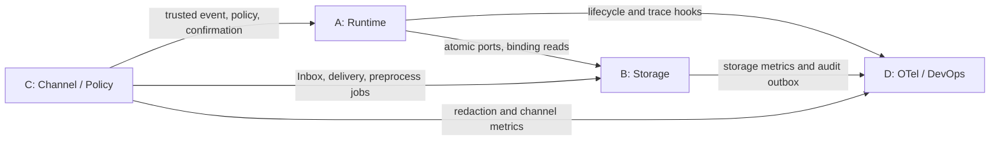
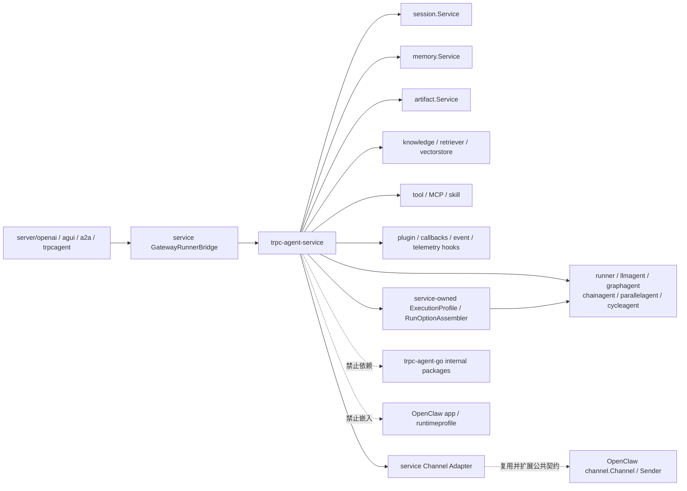

# trpc-agent-service 模块边界与上游集成方案

| 文档属性 | 内容 |
|---|---|
| 设计状态 | 实施基线 |
| 适用范围 | A/B/C/D 四个内部模块及 `trpc-agent-go` 公共 API 集成 |
| 核心目标 | 固定依赖方向、共享契约、能力归属和上游扩展门禁 |
| 配套计划 | [实施路线与交付计划](7.implementation-roadmap.md) |

A/B/C/D 是同一个服务内部的四个功能模块，不代表人员或团队划分。模块化的目的，是冻结依赖方向、缩小实现和测试范围，并允许按正确顺序逐步完成整个系统。

## 1. 模块定义

| 模块 | 定位 | 模块内能力 | 边界外能力 |
|---|---|---|---|
| A | 多租户、多节点 Runtime | TenantContext/Envelope、Gateway、Worker、ExecutionProfile Resolver、Broker、lease/fence、业务 Relay、suspend/resume | Agent 框架实现；Storage 后端内部事务 |
| B | Storage 与数据一致性 | Router、tenant facade、AgentApp Repository/发布事务、AtomicSessionStore、Inbox/Outbox、数据模型、迁移 | Worker 调度；业务 Relay 和 Audit Relay 进程 |
| C | IM、治理与安全 | Channel Framework、WeCom、Feishu、Preprocess、Policy、确认语义、Secret/Redactor | Gateway/Worker 调度；Runner suspension handler |
| D | Observability、Audit、DevOps | OTel、指标、Audit Relay、部署、灰度、容量、Runbook | 业务 Relay；业务一致性协议 |

“边界外能力”不是不实现，而是必须通过对应模块的公开接口组合，禁止在当前模块重复建设。

## 2. 统一契约

四个模块共同使用并版本化：TenantContext、ExecutionBinding、TenantStatusChange、AgentAppRevision、ExecutionEnvelope、ChannelEvent、ReplyEvent、CommitTurn、Outcome、AuditEvent、TraceContext、ConfigSnapshot version、PolicySnapshot version 和 typed errors。Tenant 根实体、App 发布与执行定义统一以[控制面领域模型](1.tenant-root-design.md)为准。

统一规则：

- 审计耗时字段使用 `latency_ms`，金额使用 `int64 cost_micros`。
- A 模块运行 Dispatch/Reply/Wakeup/TenantControl 业务 Relay；D 模块运行 Audit Relay；两者都通过 B 模块 Outbox 接口。
- A 模块的 session `fence` 与 C 模块的 Channel `connection_lease` 分开命名和存储。
- A 模块实现 Runner suspend/checkpoint/resume；C 模块定义 SuspensionRequest、确认和 grant 语义。
- C 模块实现 Preprocess Worker，使用 B 模块的 job claim/lease；D 模块提供部署、指标和告警。
- B 模块按 `(request_id,input_seq,stage,ordinal)` 确定性派生 Reply 标识并在 CommitTurn 中分配稳定 `event_seq`，A/C 模块只透传。
- Agent App 领域契约位于 `trpcservice/agentapp`；B 实现 PostgreSQL Repository 与发布事务，A 只消费固定 Revision 并生成运行时 ExecutionProfileSnapshot。
- `agent_app_revision` 是 Agent 定义的唯一发布版本；ConfigVersion 和 PolicyVersion 分别负责租户组合配置和动态治理，运行时投影禁止再维护独立版本计数。

## 3. 依赖关系



依赖规则：

1. A 可以先依赖 B 的 fake/contract 开发，但多节点生产开关必须等待 PostgreSQL AtomicStore。
2. C 可以先依赖 fake Inbound/Reply ports；真实 WeCom/Feishu 验收需要 A 的业务 Relay 和 B 的 Delivery Ledger。
3. D 先冻结 trace、metric、AuditEvent 语义，再由 A/B/C 接入埋点。
4. B 不反向依赖具体 Channel 或 Worker；C 不直接操作 Session backend；A 不拼接 B 的数据库表和 Redis key。

## 4. 单人实施顺序

按依赖关系执行，而不是同时铺开四条线：

1. 冻结四模块共享契约和 fake。
2. 实现 B 的 PostgreSQL 基线与原子接口。
3. 实现 A 的单机执行，再扩展 Broker、lease/fence 和 Relay。
4. 实现 C 的公共 Channel 契约，再完成 WeCom、Feishu 和治理。
5. 在每个阶段接入 D 的 trace、指标和审计，最后完成部署与演练。

跨模块临时代码必须记录所属模块、删除条件和截止里程碑，不能因为由同一人实现就绕过模块边界。

## 5. `trpc-agent-go` 依赖原则

`trpc-agent-service` 通过固定 module version 使用核心 `trpc-agent-go` 公共 API，不复制框架实现，也不导入任何 `internal` 包。IM 模块必须复用并扩展 OpenClaw 的公共 Channel 契约；在该契约仍属于独立 Go 1.24.1 产品模块期间，生产源码暂不直接依赖，按 §8.3 的上游抽取或显式升级门禁闭环。当前核心基线为正式 release tag `v1.11.2`（Go 1.21）；升级依赖前必须运行 service contract、兼容性和故障测试。

内部模块与公共依赖关系：



## 6. 可直接复用的公共能力

- `runner.Runner`、Managed/Steerable Runner 与 AgentFactory 装配入口；service 注入 tenant-aware services，不改写 event stream/cancel 语义。
- `llmagent.New`、`graphagent.New`、`chainagent.New`、`parallelagent.New`、`cycleagent.New` 及公开 options。
- `agent.WithAppName`、`agent.WithRequestID`、`agent.WithModel`/`WithModelName`。
- `agent.WithToolFilter`、`agent.WithToolPermissionPolicy`/`WithToolPermissionPolicyFunc`、`agent.WithToolExecutionFilter`。
- Graph checkpoint/resume 基座：`graph.CfgKeyCheckpointID`、带 `ResumeMap` 字段的 `graph.ResumeCommand`。
- 下一用户回合路由：`runner.WithAwaitUserReplyRouting`、`agent.AwaitUserReplyRoute`。
- `session.Service`、`memory.Service`、`artifact.Service` 及其公开后端；`knowledge.Knowledge`、Retriever、VectorStore、Source、Embedder。
- Tool、MCP Tool、`skill.Repository`/`RepositoryProvider`、Skill scope/load 协议。
- `plugin.Plugin`/Manager、Agent/Model/Tool callbacks、Agent Event 和 OpenTelemetry 扩展点。
- `server/openai`、`server/a2a`、`server/trpcagent` 的协议解析和事件转换；`server/agui` 在包含该公共包的目标上游版本通过门禁后复用。
- OpenClaw `channel.Channel` 的 `ID/Run` 生命周期，以及 `TextSender`、`MessageSender` 和出站值对象；直接 import 须先通过 §8.3 的 module/toolchain 门禁。

`openclaw/app`、`runtimeprofile`、单应用 `GatewayClient` 和 `internal` Telegram 实现不属于可复用边界。Worker 通过 service-owned `ExecutionProfileResolver` 将固定 Agent App Revision、ConfigSnapshot 和 PolicySnapshot 解析为运行时投影，再由 `RunOptionAssembler` 组装核心 `agent.RunOption`。跨 Broker 只传版本化事实和引用，不传 RunOption、Agent、数据库客户端或 secret。

## 7. service 自有能力

以下能力属于 `trpc-agent-service`，不能下沉到通用 Agent SDK：

- TenantContext 和版本化 ConfigSnapshot；
- AgentApp、不可变 AgentAppRevision、发布/回滚协议和版本化执行引用；
- ExecutionProfileSnapshot、ExecutionProfileResolver 和 RunOptionAssembler；
- Gateway、Worker、Broker、lease/fence 和业务 Relay；
- Inbox/Outbox、AtomicSessionStore 和 Storage Router；
- 扩展 OpenClaw 公共 Channel 契约的 WeCom/Feishu Adapter，以及多租户 Binding、Inbox、Delivery Ledger；
- 租户治理、确认、密钥、审计和部署。
- ModelProfile、BackendProfile、Provider Catalog、严格 schema/digest 和生产 Factory；
- 公开 route 候选发现、短期 CandidateToken、ScopedVerifierHandle 与 verified promotion；
- HTTP run/status/cancel、SSE cursor/replay 和稳定 telemetry/no-op Provider Port。
- 上游协议 Server 的 GatewayRunnerBridge、可信 ServerInvocationContext 和 Task/Event Store 状态映射。
- Skill Catalog/不可变 staging、TenantKnowledge facade、Knowledge ingestion/version lifecycle。

Runner 注入 tenant-aware Session/Memory/Artifact/Knowledge facade；AgentFactory 按固定 Snapshot 装配 Agent/Runner/Skill，RuntimeBundleManager 按 tenant/app/revision/digest/config/policy 构建键独占复用与生命周期所有权，负责引用计数、retire 与关闭。

上述 Profile、ingress、HTTP 和 telemetry 能力的 service-owned 契约分别以 [控制面领域模型（第三部分）](1.tenant-root-design.md#第三部分-modelbackend-profile-与-provider-catalog)、[C 模块](4.channel-governance-security-design.md)、[A 模块](2.gateway-worker-design.md)和[D 模块](5.observability-audit-devops-design.md)为准。Channel 只复用批准的 OpenClaw 公共契约，不复制或导入产品运行时和 `internal` Provider；所有扩展均不得建立与 AgentAppRevision、ExecutionBinding、TaskStore 或 AtomicSessionStore 重复的真相。

## 8. 必须闭环的上游能力缺口

### 8.1 Turn transaction

Runner 可能在执行过程中调用 Session 写接口，而分布式提交要求 event、state 和 Outbox 原子提交。首选在上游增加 Turn transaction/commit hook，使 Runner 在事务 facade 中执行，Worker 到终态统一 Commit/Rollback。

若上游扩展尚未合入，service 使用缓冲型 `TransactionalTenantSessionService`：写入 TurnTx buffer、读取 overlay、终态调用 AtomicSessionStore。该方案必须覆盖 summary、异常、event channel 和副作用测试，不得以普通分步写作为生产临时方案。

### 8.2 Suspension/resume

权限 `ask` 必须真正暂停执行，而不是只向模型返回 `approval_required`。实现不从零重写 Runner：GraphAgent 复用上游 checkpoint saver、`CfgKeyCheckpointID` 和带 `ResumeMap` 字段的 `ResumeCommand`；LLM/non-graph Agent 通过 `WithToolExecutionFilter` 将确认类调用交还 service，持久化 tool_call 后以 `model.NewToolMessage` continuation 恢复。service 仍负责 waiting commit、lease 释放、confirmation/grant、fence 接管和一次性恢复。`AwaitUserReplyRoute` 只提供下一回合路由，不能替代该状态机。

上游 `PermissionActionAsk` 会产生 `approval_required` 权限结果，但本身不保证跨节点 durable suspension。checkpoint/tool-call continuation 任一路径未通过故障接管测试前，危险工具确认不能标记为生产完成，并必须 fail closed 为 deny。

### 8.3 OpenClaw Channel 契约与协议复用

目标不是重写一套与 tRPC-Agent-Go 无关的 Channel，而是形成两层扩展：

```text
OpenClaw public channel contract
  Channel(ID, Run)
  TextSender / MessageSender / OutboundMessage
        ↓ embed / compile-time assertion
trpc-agent-service Adapter
  PublicRoute / scoped Verify / Decode / Deliver / Capabilities
        ↓ provider implementation
WeCom protocol + Feishu official SDK
```

上游首选变更是把 `openclaw/channel` 与必要的无产品状态 registry contract 抽到核心 `trpc-agent-go` 模块，保持与核心模块相同的 Go/toolchain 基线。完成后 service：

1. 在 `channels/contract.Adapter` 中嵌入上游 `channel.Channel`；
2. 为 fake、WeCom、Feishu 增加 `var _ channel.Channel = (*Provider)(nil)`；
3. 以 OpenClaw compatibility suite 验证 ID 稳定性、Run 取消、sender capability 和出站值对象，再以 service contract suite 验证 tenant/secret/Inbox/Delivery 语义；
4. Provider Registry 只接受受信代码注册和严格 schema 配置，不允许远端配置注册 Factory；
5. `TextSender/MessageSender` 只能位于 Delivery Ledger 之后，不能成为绕过 `Deliver` 的第二条发送路径。

当前独立 `trpc-agent-go/openclaw` module 声明 Go 1.24.1，不能在本服务 Go 1.21 基线上静默加入。上游公共包发布前使用同形兼容接口只是过渡，不计“直接复用完成”；直接引入独立 module 必须先批准 toolchain 升级、依赖图/SBOM 和核心版本收敛 ADR。无论采用哪条路径，都禁止 `openclaw/app`、`runtimeprofile`、`registry.ChannelDeps.Gateway` 与 `internal/channel/telegram` 进入服务数据面。

协议层方面，Feishu 优先复用官方 Go SDK 的公开 API，WeCom 协议封装隔离在 service-owned Provider。任何 Provider 都不得导入其他 module 的 `internal` 实现或复制 internal 代码形成长期 fork；SDK DTO 也不能越过 Adapter 进入 Gateway/Worker。

## 9. 能力登记与启动门禁

每项依赖记录：

```text
capability
required status
upstream issue or PR
minimum trpc-agent-go version
service fallback
contract test
```

状态统一使用 `required/proposed/accepted/implemented`。启动时 capability check 发现下列能力缺失必须 fail closed：

- distributed 模式缺少 AtomicTurnCommit；
- 多 Worker 模式使用 InMemory 权威 Session；
- 危险工具启用 ask 但没有 suspension/resume；
- Adapter 配置引用不可访问的 secret 或不可信 protocol 实现；
- Envelope 固定的 Agent App Revision、Config 或 Policy 版本无法被 Resolver 精确解析。

能力登记基线：

| capability | 归属与最低基线 | service 实现或 fallback | 启动门禁 |
|---|---|---|---|
| Runner event stream / AgentFactory | 核心 `trpc-agent-go` @ `v1.11.2`，Go 1.21 | 直接复用 | 符号或 contract 缺失则拒绝启动 Worker |
| LLM/Graph/Chain/Parallel/Cycle Agent | 对应核心公开 agent packages | AgentSpecV1 + 精确子 Revision 装配 | 类型、拓扑或资源上限 contract 未通过时拒绝发布该类型 |
| Agent App revision / ExecutionProfile resolution | `trpc-agent-service/agentapp` + `profile` 自有 | App Revision 是权威版本；Resolver + RunOptionAssembler 生成运行时投影 | 禁止第二套 Agent 定义版本；版本/digest 无法解析则拒绝执行 |
| Tool visibility | 核心 `agent.WithToolFilter` | PolicySnapshot 编译；仅作软可见性 | 缺失时不暴露 tenant 工具 |
| Tool execution permission | 核心 `WithToolPermissionPolicy`/`WithToolExecutionFilter` | 参数/资源授权与 confirmation routing | 缺失时 tenant 工具全部 deny |
| Graph checkpoint/resume | 核心 graph checkpoint、`ResumeCommand` | service waiting/confirmation/fence 编排 | `ask` 未通过接管测试则 deny |
| AtomicTurnCommit | 上游当前无公共 commit hook | `TransactionalTenantSessionService` + AtomicSessionStore | distributed 模式缺失则拒绝启动 |
| Knowledge query/ingestion | 核心 Knowledge/Retriever/VectorStore/Source/Embedder 公共契约 | TenantKnowledge + versioned ingestion lifecycle | 无强制 tenant/version filter 或 digest 漂移则拒绝检索 |
| Skill repository/load | 核心 Skill Repository/Provider/scope/load 公共契约 | 不可变 tenant staging + capability convergence | 路径、scope、digest 或授权无法证明则不装配 Skill |
| Plugin/callback telemetry | 核心 Plugin 与 Agent/Model/Tool callbacks | mandatory Guard 外包、稳定 telemetry adapter | callback 顺序/覆盖不明时敏感路径 fail closed |
| Protocol server facades | `server/openai/a2a/trpcagent`；AG-UI 需目标版本公共包 | GatewayRunnerBridge + shared Task/Event Store | 无法禁用本地 Runner/InMemory fallback 则对应 listener 不启动 |
| OpenClaw Channel public contract | `required`；目标为核心 `trpc-agent-go` 中 Go 1.21 兼容的稳定公共包，或经 ADR 批准的独立 module | 当前同形兼容接口仅供开发；Adapter 作为 `Channel` 超集 | 未通过 compile-time assertion、compatibility suite 和依赖门禁时，真实 IM binding 不得标记生产可用 |
| WeCom/Feishu protocol | service-owned Provider | 官方 API、fixtures、公共 Channel contract | Provider contract/secret 不可用则对应 binding fail closed |

当前 `lint.sh` 必须检查 `go list -m all` 和源码 import：上游公共 Channel 包未通过 §8.3 门禁前，出现独立 `trpc-agent-go/openclaw` module 即失败；任何阶段出现 `openclaw/app`、`runtimeprofile`、上游 `internal` 包或未经批准的 Go/toolchain 升级均直接失败。公共 Channel 集成获批后，依赖检查改为精确 allowlist，只允许已审查的 Channel 叶子包，并继续禁止产品运行时和间接越界依赖。

## 10. tRPC-Agent-Go 能力复用追踪矩阵

本文统一使用四种裁决：`直接复用` 表示按固定版本调用公共 API；`适配复用` 表示实现上游公共接口并注入租户/分布式语义；`平台扩展` 表示通用框架不应承担的多租户能力；`上游能力门禁` 表示目标公共能力尚不在当前基线，满足版本、toolchain、依赖和 contract test 后才能启用。文档和验收不得把“接口同形”写成“已直接复用”。

| 平台需求 | 上游公共能力 | 复用方式 | service 平台层 | 禁止路径与设计门禁 |
|---|---|---|---|---|
| Agent 编排 | `agent/llmagent`、`agent/graphagent`、`agent/chainagent`、`agent/parallelagent`、`agent/cycleagent` | 直接复用构造器/options；由版本化 AgentSpec 确定性装配 | 租户 Agent 注册、不可变发布、精确子 Revision 路由、拓扑/资源上限 | 不重写调度算法；未知 schema、递归环、无界并发/迭代拒绝发布 |
| 执行入口 | `runner.Runner`、Managed/Steerable Runner、流式 `event.Event`、context cancel | 直接复用；Bundle 内注入 Agent 与 tenant facades | Broker Worker、lease/fence、TurnTx、无状态扩缩容、durable suspension | Gateway 不本地执行；缺 AtomicTurnCommit/接管能力时 distributed/ask fail closed |
| Session | `session.Service` 与公开后端 | 适配复用 `TenantSessionService` | tenant key、RYW、fence、AtomicTurnCommit | 不使用 InMemory 作为多节点权威存储 |
| Memory | `memory.Service` 与公开后端 | 适配复用 `TenantMemoryService` | tenant scope、水位、迁移和对账 | AppName/UserID 不作为租户边界 |
| Artifact | `artifact.Service` 与公开后端 | 适配复用 `TenantArtifactService` | tenant object key、版本、扫描和生命周期 | 不接受任意外部 URL/路径直达模型或 Tool |
| Knowledge | `knowledge.Knowledge`、Retriever、VectorStore、Source、Embedder | 适配复用 `TenantKnowledge` | 固定 Knowledge version、强制 filter、摄取发布/迁移 | filter 不能被调用方覆盖；跨租户结果或后端无 filter 能力 fail closed |
| Tool / MCP | `tool`、MCP Tool、ToolSet、权限 RunOptions | 直接复用执行协议，外包 tenant-scoped wrapper | Catalog/version、allowlist、Secret 注入、参数/资源 Guard | 裸 Tool、动态/子 Agent、framework tool 均不能绕过最终 Guard |
| Skill | `skill.Repository`、Rooted/Refreshable Repository、RepositoryProvider、scope/load 协议；LLM Skill options | 适配复用不可变 scoped Repository | Skill Catalog、content digest、tenant staging、Tool/Knowledge/Secret capability 收敛 | tenant 不上传代码/Repository；路径逃逸、digest 漂移或 `latest` 回退拒绝 |
| Plugin / Guardrail / Callbacks | Plugin Manager；Agent/Model/Tool callbacks | 直接复用扩展点，平台 Guard 包裹在最外层 | 策略下发、预算、DLP、确认、强制审计、callback sandbox | tenant 不能删除/重排 mandatory guard；callback 不能修改可信上下文或授权 |
| OpenAI 服务化 | `server/openai` | 适配复用协议/event 转换，注入 GatewayRunnerBridge | 认证、tenant/app route、Inbox/Task/Event Store、幂等与回放 | 禁止默认本地 Runner/InMemory fallback |
| AG-UI 服务化 | 目标版本公开 `server/agui` | 上游能力门禁；具备后按同一 Bridge 适配 | thread/run 持久映射、认证、恢复和取消 | 当前核心 `v1.11.2` 不含该包；禁止复制实现后宣称上游复用 |
| A2A 服务化 | `server/a2a` Processor、TaskManager、converter、auth middleware 扩展 | 适配复用，状态端口连接平台 Store | task/request 映射、分布式状态、取消、审计 | server 进程内 task map 不作为权威状态 |
| tRPC-Agent 服务化 | `server/trpcagent` | 适配复用并注入 GatewayRunnerBridge | 统一 Gateway/Admin、可信 route 与版本固定 | app name 不能直接决定 tenant 或绕过 PrepareDispatch |
| IM 接入 | OpenClaw `channel.Channel`、Text/Message Sender、Outbound 值对象 | 上游公共包通过 §8.3 后直接复用并扩展 | WeCom/Feishu Adapter、Binding、候选验签、Inbox、Delivery Ledger | 禁止产品 app/runtimeprofile/internal Provider；门禁前同形接口只算 blocked fallback |
| 可观测性 | Runner event、Plugin、Agent/Model/Tool callbacks、上游 OTel hooks | 直接/适配复用并接续 trace context | 稳定 Provider Port、租户审计、usage/cost、低基数指标、可靠 Audit Outbox | 不重复 span/计费；Trace 不作审计，tenant/user 不作常规 metric label |

该矩阵是“是否覆盖复用要求”的验收索引。详细规范分别位于：Agent/Skill 见[控制面 §8](1.tenant-root-design.md)，Server/Runner 见[Gateway/Worker §2](2.gateway-worker-design.md)，Storage/Knowledge 见[Storage §4](3.storage-data-consistency-design.md)，Channel/治理见[C 模块 §1、§8](4.channel-governance-security-design.md)，Telemetry 见[D 模块 §1](5.observability-audit-devops-design.md)。发生上游 API 或版本变化时先更新本矩阵和 capability registry，再更新局部设计；不能只修改实现依赖。
