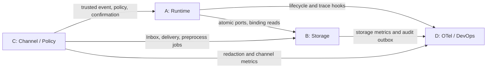
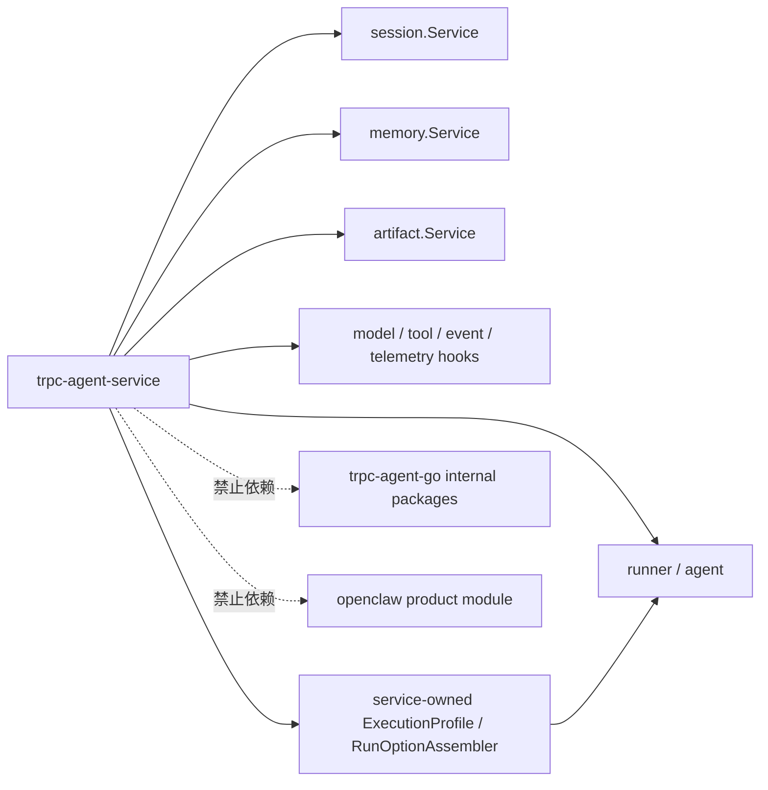

# trpc-agent-service 模块边界与上游集成方案

| 文档属性 | 内容 |
|---|---|
| 设计状态 | 实施基线 |
| 适用范围 | A/B/C/D 四个内部模块及 `trpc-agent-go` 公共 API 集成 |
| 核心目标 | 固定依赖方向、共享契约、能力归属和上游扩展门禁 |
| 配套计划 | [实施路线与交付计划](7.implementation-roadmap.md) |

A/B/C/D 是同一个服务内部的四个功能模块，不代表人员或团队划分。模块化的目的，是冻结依赖方向、缩小实现和测试范围，并允许按正确顺序逐步完成整个系统。

## 1. 模块定义

| 模块 | 定位 | 模块内能力 | 边界外能力 |
|---|---|---|---|
| A | 多租户、多节点 Runtime | TenantContext/Envelope、Gateway、Worker、ExecutionProfile Resolver、Broker、lease/fence、业务 Relay、suspend/resume | Agent 框架实现；Storage 后端内部事务 |
| B | Storage 与数据一致性 | Router、tenant facade、AgentApp Repository/发布事务、AtomicSessionStore、Inbox/Outbox、数据模型、迁移 | Worker 调度；业务 Relay 和 Audit Relay 进程 |
| C | IM、治理与安全 | Channel Framework、Telegram、WeCom、Preprocess、Policy、确认语义、Secret/Redactor | Gateway/Worker 调度；Runner suspension handler |
| D | Observability、Audit、DevOps | OTel、指标、Audit Relay、部署、灰度、容量、Runbook | 业务 Relay；业务一致性协议 |

“边界外能力”不是不实现，而是必须通过对应模块的公开接口组合，禁止在当前模块重复建设。

## 2. 统一契约

四个模块共同使用并版本化：TenantContext、ExecutionBinding、TenantStatusChange、AgentAppRevision、ExecutionEnvelope、ChannelEvent、ReplyEvent、CommitTurn、Outcome、AuditEvent、TraceContext、ConfigSnapshot version、PolicySnapshot version 和 typed errors。Tenant 根实体、App 发布与执行定义统一以[控制面领域模型](1.tenant-root-design.md)为准。

统一规则：

- 审计耗时字段使用 `latency_ms`，金额使用 `int64 cost_micros`。
- A 模块运行 Dispatch/Reply/Wakeup/TenantControl 业务 Relay；D 模块运行 Audit Relay；两者都通过 B 模块 Outbox 接口。
- A 模块的 session `fence` 与 C 模块的 Channel `connection_lease` 分开命名和存储。
- A 模块实现 Runner suspend/checkpoint/resume；C 模块定义 SuspensionRequest、确认和 grant 语义。
- C 模块实现 Preprocess Worker，使用 B 模块的 job claim/lease；D 模块提供部署、指标和告警。
- B 模块在 CommitTurn 中按稳定顺序派生 Reply `event_seq`，A/C 模块只透传。
- Agent App 领域契约位于 `trpcservice/agentapp`；B 实现 PostgreSQL Repository 与发布事务，A 只消费固定 Revision 并生成运行时 ExecutionProfileSnapshot。
- `agent_app_revision` 是 Agent 定义的唯一发布版本；ConfigVersion 和 PolicyVersion 分别负责租户组合配置和动态治理，运行时投影禁止再维护独立版本计数。

## 3. 依赖关系



依赖规则：

1. A 可以先依赖 B 的 fake/contract 开发，但多节点生产开关必须等待 PostgreSQL AtomicStore。
2. C 可以先依赖 fake Inbound/Reply ports；真实 Telegram/WeCom 验收需要 A 的业务 Relay 和 B 的 Delivery Ledger。
3. D 先冻结 trace、metric、AuditEvent 语义，再由 A/B/C 接入埋点。
4. B 不反向依赖具体 Channel 或 Worker；C 不直接操作 Session backend；A 不拼接 B 的数据库表和 Redis key。

## 4. 单人实施顺序

按依赖关系执行，而不是同时铺开四条线：

1. 冻结四模块共享契约和 fake。
2. 实现 B 的 PostgreSQL 基线与原子接口。
3. 实现 A 的单机执行，再扩展 Broker、lease/fence 和 Relay。
4. 实现 C 的公共 Channel 契约，再完成 Telegram、WeCom 和治理。
5. 在每个阶段接入 D 的 trace、指标和审计，最后完成部署与演练。

跨模块临时代码必须记录所属模块、删除条件和截止里程碑，不能因为由同一人实现就绕过模块边界。

## 5. `trpc-agent-go` 依赖原则

`trpc-agent-service` 通过固定 module version 使用核心 `trpc-agent-go` 公共 API，不复制框架实现、不导入 `internal` 包，也不 require/import 独立 `openclaw` 产品模块。当前设计核对基线为正式 release tag `v1.11.2`（核心模块 Go 1.21）；升级依赖前必须运行 service contract、兼容性和故障测试。

内部模块与公共依赖关系：



## 6. 可直接复用的公共能力

- `runner.Runner` 与 `runner.NewRunnerWithAgentFactory`。
- `agent.WithAppName`、`agent.WithRequestID`、`agent.WithModel`/`WithModelName`。
- `agent.WithToolFilter`、`agent.WithToolPermissionPolicy`/`WithToolPermissionPolicyFunc`、`agent.WithToolExecutionFilter`。
- Graph checkpoint/resume 基座：`graph.CfgKeyCheckpointID`、带 `ResumeMap` 字段的 `graph.ResumeCommand`。
- 下一用户回合路由：`runner.WithAwaitUserReplyRouting`、`agent.AwaitUserReplyRoute`。
- `session.Service`、`memory.Service`、`artifact.Service` 及其公开后端。
- Model、Tool、Agent Event 和 OpenTelemetry 扩展点。

`openclaw/runtimeprofile` 位于独立 Go 1.24.1 产品模块，不属于上述公共能力。Worker 通过 service-owned `ExecutionProfileResolver` 将固定 Agent App Revision、ConfigSnapshot 和 PolicySnapshot 解析为运行时投影，再由 `RunOptionAssembler` 组装核心 `agent.RunOption`。跨 Broker 只传版本化事实和引用，不传 RunOption、Agent、数据库客户端或 secret。

## 7. service 自有能力

以下能力属于 `trpc-agent-service`，不能下沉到通用 Agent SDK：

- TenantContext 和版本化 ConfigSnapshot；
- AgentApp、不可变 AgentAppRevision、发布/回滚协议和版本化执行引用；
- ExecutionProfileSnapshot、ExecutionProfileResolver 和 RunOptionAssembler；
- Gateway、Worker、Broker、lease/fence 和业务 Relay；
- Inbox/Outbox、AtomicSessionStore 和 Storage Router；
- Telegram/WeCom Channel Adapter 和 Delivery Ledger；
- 租户治理、确认、密钥、审计和部署。

Runner 注入 tenant-aware Session/Memory/Artifact facade；AgentFactory 按固定 Snapshot 装配 Agent/Runner，RuntimeBundleManager 按 tenant/app/revision/digest/config/policy 构建键独占复用与生命周期所有权，负责引用计数、retire 与关闭。

## 8. 必须闭环的上游能力缺口

### 8.1 Turn transaction

Runner 可能在执行过程中调用 Session 写接口，而分布式提交要求 event、state 和 Outbox 原子提交。首选在上游增加 Turn transaction/commit hook，使 Runner 在事务 facade 中执行，Worker 到终态统一 Commit/Rollback。

若上游扩展尚未合入，service 使用缓冲型 `TransactionalTenantSessionService`：写入 TurnTx buffer、读取 overlay、终态调用 AtomicSessionStore。该方案必须覆盖 summary、异常、event channel 和副作用测试，不得以普通分步写作为生产临时方案。

### 8.2 Suspension/resume

权限 `ask` 必须真正暂停执行，而不是只向模型返回 `approval_required`。实现不从零重写 Runner：GraphAgent 复用上游 checkpoint saver、`CfgKeyCheckpointID` 和带 `ResumeMap` 字段的 `ResumeCommand`；LLM/non-graph Agent 通过 `WithToolExecutionFilter` 将确认类调用交还 service，持久化 tool_call 后以 `model.NewToolMessage` continuation 恢复。service 仍负责 waiting commit、lease 释放、confirmation/grant、fence 接管和一次性恢复。`AwaitUserReplyRoute` 只提供下一回合路由，不能替代该状态机。

上游 `PermissionActionAsk` 会产生 `approval_required` 权限结果，但本身不保证跨节点 durable suspension。checkpoint/tool-call continuation 任一路径未通过故障接管测试前，危险工具确认不能标记为生产完成，并必须 fail closed 为 deny。

### 8.3 Channel 协议复用

另一个 Go module 的 Telegram `internal` 实现不可导入。生产 Adapter 应使用官方 API 自行实现，或使用上游导出的稳定、无 tenant 语义的公共 protocol provider；不能复制 internal 代码形成长期 fork。

## 9. 能力登记与启动门禁

每项依赖记录：

```text
capability
required status
upstream issue or PR
minimum trpc-agent-go version
service fallback
contract test
```

状态统一使用 `required/proposed/accepted/implemented`。启动时 capability check 发现下列能力缺失必须 fail closed：

- distributed 模式缺少 AtomicTurnCommit；
- 多 Worker 模式使用 InMemory 权威 Session；
- 危险工具启用 ask 但没有 suspension/resume；
- Adapter 配置引用不可访问的 secret 或不可信 protocol 实现；
- Envelope 固定的 Agent App Revision、Config 或 Policy 版本无法被 Resolver 精确解析。

能力登记基线：

| capability | 归属与最低基线 | service 实现或 fallback | 启动门禁 |
|---|---|---|---|
| Runner event stream / AgentFactory | 核心 `trpc-agent-go` @ `v1.11.2`，Go 1.21 | 直接复用 | 符号或 contract 缺失则拒绝启动 Worker |
| Agent App revision / ExecutionProfile resolution | `trpc-agent-service/agentapp` + `profile` 自有 | App Revision 是权威版本；Resolver + RunOptionAssembler 生成运行时投影 | 禁止第二套 Agent 定义版本；版本/digest 无法解析则拒绝执行 |
| Tool visibility | 核心 `agent.WithToolFilter` | PolicySnapshot 编译；仅作软可见性 | 缺失时不暴露 tenant 工具 |
| Tool execution permission | 核心 `WithToolPermissionPolicy`/`WithToolExecutionFilter` | 参数/资源授权与 confirmation routing | 缺失时 tenant 工具全部 deny |
| Graph checkpoint/resume | 核心 graph checkpoint、`ResumeCommand` | service waiting/confirmation/fence 编排 | `ask` 未通过接管测试则 deny |
| AtomicTurnCommit | 上游当前无公共 commit hook | `TransactionalTenantSessionService` + AtomicSessionStore | distributed 模式缺失则拒绝启动 |
| Telegram/WeCom protocol | service-owned Provider | 官方 API、fixtures、公共 Channel contract | Provider contract/secret 不可用则对应 binding fail closed |

`lint.sh` 必须检查 `go list -m all` 和源码 import：出现 `trpc.group/trpc-go/trpc-agent-go/openclaw`、任何上游 `internal` 包，或核心 Go/toolchain 基线非预期升级时直接失败。若未来决定引入 openclaw，必须以新的架构决策记录显式修改依赖原则、Go 版本、SBOM 和兼容测试，不能由间接依赖悄然进入。
