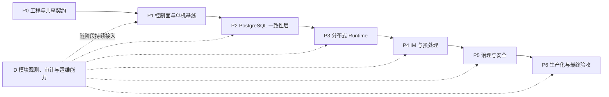

# trpc-agent-service 实施路线与交付计划

| 文档属性 | 内容 |
|---|---|
| 计划周期 | 2026-08-21 至 2026-09-11 |
| 实施模式 | 单人按模块依赖顺序交付 |
| 生产基线 | PostgreSQL、Redis、两个无状态 Worker、WeCom、Feishu |
| 完成定义 | 代码、迁移、部署、测试、观测、演练和文档同时通过门禁 |

本文同时定义逻辑实施阶段和 2026-08-21 至 2026-09-11 的单人实施排期。

## 1. 阶段依赖与交付门禁



每一阶段只有在退出条件通过后才能成为下一阶段的实施基线；允许使用 fake port 提前开发，但不得绕过生产一致性或安全门禁。

### 1.1 当前实现状态快照（2026-08-25）

状态采用根 README 的统一口径；以下只记录仓库中可定位的能力，不把设计文档、占位包或测试计划计为实现：

| 能力 | 当前状态 | 证据/缺口 |
|---|---|---|
| Tenant、AgentApp/Revision、Config 控制面 | `implemented` | 已有领域类型、InMemory/PostgreSQL Repository、migration 和 Admin HTTP；生产验收仍看后续门禁 |
| PostgreSQL AtomicSessionStore、Inbox/Outbox 基线 | `implemented` | 已有持久 Event/state 恢复、加密 Input/Result payload、Reply Outbox、migration、store 与 contract/integration test；summary compaction 与其余 Relay 仍逐项验收 |
| Redis Broker/lease 与双 Worker slice | `implemented` | 已有 adapter 和集成切片；Relay、reclaim、drain 全门禁仍逐项登记 |
| OpenClaw Channel 公共契约复用 | `blocked` | 独立 module 要求 Go 1.24.1；等待公共 Channel 叶子包抽入核心模块，或通过显式 toolchain/依赖 ADR；当前同形接口不计直接复用 |
| pre-tenant candidate/scoped verifier | `contract_frozen` | C 模块已冻结契约，代码尚未实现；真实 Channel 前保持 blocker |
| Model/Backend Profile 与 Provider Catalog | `implemented` | 已有严格 Catalog、不可变 PostgreSQL Repository、精确版本外键、Agent/Config 发布门禁与 legacy binding 升级演练；生产 adapter/client factory 仍属后续项 |
| HTTP/SSE production Gateway | `contract_frozen` | HTTP run/status/cancel、cursor/replay 已冻结；现有 fake/web 占位不计实现 |
| 全 Agent/Skill/Knowledge 复用契约 | `contract_frozen` | LLM/Graph/Chain/Parallel/Cycle、Skill Repository 和 TenantKnowledge 的版本/隔离/装配门禁已冻结，代码状态另行验收 |
| 上游协议 Server 复用 | `contract_frozen` | GatewayRunnerBridge 与 OpenAI/A2A/tRPC-Agent 映射已冻结；AG-UI 等待包含公共包的目标版本能力门禁 |
| WeCom/Feishu、Governance、Audit/DevOps | `contract_frozen` | 按 P4–P6 实现和验证，不以设计完整度代替完成状态 |

每次合并实现切片必须更新本表或链接到更细能力台账，并附可复现验证命令。

## 2. 逻辑实施阶段

### P0：工程与契约

- 固定 `trpc-agent-go` 版本；配置、日志、OTel 和优雅退出骨架。
- 固定核心模块 revision/Go 1.21；依赖检查禁止 OpenClaw 产品运行时和上游 `internal` import，并为获批的公共 Channel 叶子包预留精确 allowlist。
- TenantContext、Envelope、ChannelEvent、ReplyEvent、Outcome、typed errors。
- PublicRouteHint、CandidateBindingContext、ScopedVerifierHandle、VerifiedBinding 和 scoped Secret types。
- OpenClaw-compatible ChannelLifecycle、sender capability、Provider Factory 和 compatibility suite；上游公共包可用后替换兼容声明并增加 compile-time assertion。
- ModelProfile/BackendProfile、Provider Catalog、Profile Snapshot/Factory 输入和稳定 telemetry Port。
- AgentSpecV1、五类 Agent 构造器映射、SkillRef/Repository scope、KnowledgeRef/query facade 及统一能力复用矩阵。
- fake Dispatcher/AtomicStore/Channel/Secret/Audit 和 contract test kit。
- 建立架构依赖检查，禁止跨层和 `internal` import。

退出：两租户通过 fake 端到端执行，序列化兼容和跨租户拒绝测试通过。

#### P0 工程起点对齐

P0 第一件事是把「设计」接到「代码仓库」，消除示范骨架与规范目录之间的偏差。

1. **依赖固定**（本仓库 go.mod 目前零依赖）：

   ```bash
   cd trpc-agent-service
   go get trpc.group/trpc-go/trpc-agent-go@v1.11.2
   # 本地联调：先让相邻仓库精确切到 release tag
   git -C ../trpc-agent-go fetch --tags upstream
   git -C ../trpc-agent-go switch --detach v1.11.2
   git -C ../trpc-agent-go describe --tags --exact-match
   go mod edit -replace trpc.group/trpc-go/trpc-agent-go=../trpc-agent-go
   ```

   核对基线为正式 release tag `v1.11.2`（核心模块 Go 1.21，已核对含当前所需公共 API）。`lint.sh` 通过 `go list -m all` 和源码 import 禁止 OpenClaw 产品运行时与上游 `internal`；公共 Channel 叶子包只有在 §8.3 门禁通过后才加入精确 allowlist。

2. **目录重构**：现有 `trpcservice/{agent,channels,config,log,metrics,skill,tenant,tool,web,workspace}` 是根 README 的历史示范，不作为实现结构。P0 起按各模块「代码组织」重建规范目录：
   - A：`runtime/` `gateway/` `broker/` `coordination/` `relay/` `worker/`（2 号 §14/§20）
   - B：`storage/` `session/` `memory/` `artifact/` `knowledge/` `messaging/` `migration/`（3 号 §13，其中 `trpcservice/migration/` 保存在线搬迁、双写和对账代码）
   - C：`channels/` `preprocess/` `governance/` `secrets/` `redaction/`（4 号 §19）
   - D：`telemetry/` `audit/` `health/`（5 号 §18）
   - 共享控制面：`agentapp/`（App/Revision/Repository contract）、`profile/`（ExecutionProfileResolver + RunOptionAssembler，6 号 §7）
   - 仓库资产：`migrations/`（版本化 PostgreSQL DDL）、`deploy/`

3. **契约符号落点**（冻结时可编译的起点，符号 → 文件 → 来源；下表代码路径均相对于 `trpcservice/`）：

   | 符号 | 目标文件 | 来源 |
   |---|---|---|
   | ExecutionEnvelope | runtime/envelope.go | 2 号 §2.1 |
   | TenantContext / ExecutionBinding | tenant/context.go | 1 号 §7.2 |
   | AgentApp / AgentAppRevision / Repository | agentapp/{app,revision,repository}.go | 1 号第二部分 §3/§7 |
   | Dispatcher / Executor / ExecutionHandle | gateway/dispatch.go | 2 号 §2 |
   | TaskStore（PrepareDispatch/GetExecution/RequestCancel/ParkInput） | gateway/taskstore.go | 2 号 §15 |
   | Broker（Publish/Consume/Ack/Reclaim） | broker/broker.go | 2 号 §15 |
   | LeaseManager（Acquire/Renew/Release/EnsureFenceAtLeast） | coordination/lease.go | 2 号 §15 |
   | AtomicSessionStore（OpenForRun/CommitTurn/GetTerminalByInputSeq/ReadLastFence） | storage/session/atomic.go | 3 号 §5 |
   | TurnTx | storage/session/turntx.go | 3 号 §17 |
   | Router / BackendBinding / CapabilitySet | storage/router.go | 3 号 §3 |
   | ChannelEvent / ProviderEvent / ReplyEvent / Adapter | channels/contract/adapter.go | 4 号 §2 |
   | CandidateBindingContext / IngressBindingResolver | channels/ingress/{candidate,resolver}.go | 4 号 §2–4 |
   | SecretScope / ScopedSecretProvider | secrets/provider.go | 4 号 §10、1 号第三部分 §5 |
   | ModelProfile / BackendProfile / ProviderSchema | modelprofile/、backendprofile/、provider/ | 1 号第三部分 §2–4 |
   | GovernanceDecision | governance/decision.go | 4 号 §17 |
   | AuditEvent | audit/event.go | 5 号 §13 |
   | ExecutionProfileResolver / RunOptionAssembler | profile/resolver.go | 6 号 §6/§7 |
   | RuntimeBundleManager / BundleLease | profile/manager.go | 2 号 §2.3 |

### P1：控制面与单机基线

- tenant 根表和状态事务；Agent App 根实体、不可变 Revision、发布/回滚事务、复合引用迁移，以及 ConfigSnapshot/Binding 管理和版本解析。
- ModelProfile/BackendProfile Repository、Provider Catalog、严格 schema/digest、同租户版本化引用和无密钥 Snapshot。
- Admin API 最小控制面：validate、publish、current/version read、copy-forward rollback；认证 tenant 与 path tenant 必须一致。
- Worker 内 service-owned ExecutionProfileResolver、RunOptionAssembler、RuntimeBundleManager、AgentFactory 和 tenant facade。
- LLM/Graph/Chain/Parallel/Cycle 的确定性装配、组合拓扑/资源上限，以及不可变 Skill staging/RepositoryProvider。
- HTTP fake channel + LocalDispatcher + mock model。

退出：tenant、Agent App 和 Profile DDL/CAS/状态审计通过；并发 Draft/发布、失败发布保持旧 Revision、历史回滚和 published 不可变测试通过；未知 provider/schema/option/model、敏感 option、endpoint SSRF、跨租户 Profile 和 Secret scope 越权均 fail closed；Config rollback 生成更大新版本；Admin 未认证或 path tenant 不匹配 fail closed；相同 user/session/app 标识在两租户间完全隔离，配置回滚只影响新请求。

### P2：PostgreSQL 一致性层

- migration、Session head/event/commit、Inbox/Outbox、terminal index；PostgreSQL 16 执行 first up/repeated up/down/empty/up-again 门禁。
- PostgreSQL AtomicSessionStore、ClaimInbox、PrepareDispatch、Delivery Ledger。
- Turn transaction bridge 和 crash/重投 contract tests。
- TenantKnowledge、强制 tenant/version filter、Knowledge 摄取发布与版本迁移 contract tests。

退出：真实 migration runner 与数据库正反例通过；并发 CAS、相等/更大/旧 fence、提交后 ACK 前崩溃、终态回读全部通过。

### P3：分布式 Runtime

- Redis Streams Broker、Dispatch/Reply/Wakeup/TenantControl Relay。
- Redis lease/fence、counter calibration、input park/wakeup。
- 2+ Worker、status/cancel、reclaim、drain；Runtime Bundle 并发构建、引用计数、retire 和有界关闭。

退出：kill 任意 Worker 后无丢失、重复业务效果、乱序提交或旧 owner 覆盖；旧 Bundle 在途可完成、新请求不再获取 retired key、引用归零后只关闭自有资源。

### P4：IM 与预处理

- 生产 HTTP/SSE Gateway、GatewayRunnerBridge；OpenAI/A2A/tRPC-Agent 协议 façade 接入共享 Inbox/Task/Event Store，AG-UI 在目标上游版本门禁通过后接入。
- 公共 Channel Framework 和 fake provider contract。
- pre-tenant public route/candidate index、单用途 verifier、verified promotion 和全局入口安全事件；验签前不创建 tenant/request 事实。
- WeCom 官方 Bot/Agent API Adapter 和官方 crypto fixtures。
- Feishu 官方 Go SDK Adapter、事件/mention fixtures 与 Reply API 幂等测试。
- Preprocess Worker、媒体 Artifact、Delivery Ledger；SSE 慢消费者降级、终态持久回放和媒体 SSRF/DNS rebinding/zip bomb 防护。

退出：伪造 route、候选不唯一、candidate token 重放、purpose 错配和验签失败均不能泄露/建立 tenant；两协议重复入站只执行一次且返回同一 request ID；Adapter/Worker kill 可恢复；回复重投不重复已确认分片。

### P5：治理与安全

- 固定 PolicyChain、工具可见/执行双重授权。
- 分布式限流、预算 reserve/settle；固定 PricingSnapshot，无法计价时金额预算 fail closed。
- 最终 Tool 执行层 tenant/request/policy Guard，裸 Tool、动态/子 Agent 和 framework tool 不得绕过。
- 验证五类 Agent 及每个组合子节点均继承相同 Plugin/callback/mandatory Guard；未知 agent kind 继续 fail closed。
- 基于 graph checkpoint 或 external tool-call continuation 的 suspension/resume、confirmation/grant。
- ScopedSecretProvider、purpose/resource/version 授权、轮换、Redactor、secret canary。

退出：动态/子 Agent 和 framework tool 不能绕过工具策略；GraphAgent 与 LLM Agent 的 ask 均可跨 Worker 真暂停和恢复；grant 只用一次；所有 telemetry sink 无密钥。

### P6：生产化

- Audit Relay、Usage Ledger、Dashboard、Alert、Runbook。
- 上游 Runner event、Plugin、Agent/Model/Tool callbacks 与 OTel context 的统一适配、无重复 span/计费验证。
- Compose、Helm、PDB/HPA/NetworkPolicy/workload identity。
- 灰度/回滚、容量压测、Redis→SQL 与 vector migration 演练。

退出：满足 [README](./README.md) 需求追踪中的全部验收项。

## 3. 实现切片规则

每个实现切片只跨一个可验证契约，并同时完成代码、测试以及适用的迁移、回滚、指标和安全处理。P2 前可以依赖 fake，P3 生产开关必须等待 AtomicStore；P5 confirmation 必须等待 Runner suspension 能力，不允许 UI 假确认。

## 4. 首个端到端验证切片

优先实现：两租户 + HTTP fake channel + PostgreSQL + Redis + 两 Worker + mock model。测试同 session 并发、重复 callback、Worker 执行中 kill、Relay publish/mark 间 kill、跨租户同 ID 和固定配置版本。通过后再接真实 IM，能最早验证系统最危险的正确性边界。

## 5. 交付周期与实施原则

- 开始日期：2026-08-21（周五）。
- 最终交付：2026-09-11（周五）。
- 单人按 `共享契约 → B 数据基线 → A 分布式 Runtime → C IM/治理 → D 生产化` 串行推进。
- 正常工作日共 16 天；周末不安排刚性任务，仅作为风险缓冲。
- D 模块的 trace、metric、audit hook 随各阶段同步加入，不能到最后集中补埋点。
- 9 月 10 日停止新增能力；9 月 11 日只处理阻断问题、最终验收和交付。

## 6. 最终交付范围

- tenant 根表、状态事务、复合默认引用、可信 TenantContext、Agent App/Revision 发布模型、版本化 ConfigSnapshot，以及 Tenant/App/Channel/Backend Binding。
- PostgreSQL 权威 Session/Inbox/Outbox/Audit 数据模型和 AtomicSessionStore。
- Redis Streams Broker、session lease、单调 fence、input_seq 三态和业务 Relay。
- 至少两个无状态 Worker，支持 reclaim、幂等重投、status/cancel 和 drain。
- 复用并扩展 OpenClaw 公共 Channel 契约的通用 Channel Framework，以及 WeCom、Feishu 两个平级 Adapter 的最小生产链路。
- Tenant-aware Session/Memory/Artifact/Knowledge Router，以及 InMemory、PostgreSQL/Redis、对象存储、向量库或外部 Memory 的统一能力接口。
- 工具白名单、用户权限、输入/输出脱敏、预算、危险工具确认和 SecretRef。
- 全链 OpenTelemetry、规定的审计字段、Compose 部署和 Kubernetes/Helm 基线。
- HTTP run/status/cancel、SSE cursor/replay、no-op telemetry Provider 和 exporter 故障降级。
- Redis→SQL、Local Vector→Remote Vector 的迁移状态机、命令和可重复演练。
- Worker kill、重复 IM、DB/Redis 短断、模型超时、工具失败、配置回滚和跨租户隔离测试。

本周期以 PostgreSQL + Redis 为完整生产基线。其他厂商后端至少完成统一 capability/contract 和可运行参考适配器或测试替身，不要求在本周期完成所有厂商优化。WeCom/Feishu 优先完成文本、基础媒体、鉴权/验签、去重和回复重试；高级卡片、撤回和流式体验可后续增强。任何范围降级必须在 9 月 4 日前记录原因、影响、替代验收和后续日期。

## 7. 逐日排期

| 日期 | 模块 | 主要工作 | 当日退出条件 |
|---|---|---|---|
| 08-21 周五 | 全局 | 冻结设计、依赖版本、模块边界和接口；建立本地质量门禁 | P0 契约、风险表、验收矩阵确定 |
| 08-24 周一 | 全局/A | TenantContext、Envelope、AgentApp/Revision contract、ExecutionProfileSnapshot、RunOptionAssembler、typed errors、fake ports；验证 TurnTx 与两类 suspension 接缝 | 核心契约可编译；AgentAppRevision 是唯一 Agent 定义版本；依赖图无产品运行时/internal；OpenClaw Channel 公共契约上游路径已登记 |
| 08-25 周二 | A/B | tenant 与 Agent App DDL、发布/回滚/状态事务、ConfigSnapshot、Admin validate/publish/read/copy-forward rollback、Binding resolver、LocalDispatcher、mock model | CAS/复合引用/发布不变性/状态审计通过；Admin tenant scope fail closed；两租户本地纵切运行且伪造 tenant 被拒绝 |
| 08-26 周三 | B | PostgreSQL migration：session/event/commit、Inbox/Outbox、terminal index、audit | PostgreSQL 16 first/repeated up、down、empty、up-again及 schema/repository/隔离测试通过 |
| 08-27 周四 | B | AtomicSessionStore、ClaimInbox、PrepareDispatch、CommitTurn、TurnTx bridge | fence/version/input_seq/commit 幂等 contract 通过 |
| 08-28 周五 | A/B | HTTP fake channel + PostgreSQL + Redis + 两 Worker + mock model | 同 session 并发、重复请求和跨租户同 ID 通过 |
| 08-31 周一 | A | Redis Streams、Dispatch/Reply/Wakeup/TenantControl Relay、reconciler | publish/mark 崩溃重投不重复业务效果，tenant version 单调收敛 |
| 09-01 周二 | A/B | lease/fence/renew/lost、counter 校准、input park/wakeup | 双 Worker 仅一个有效提交；旧 fence 永久拒绝 |
| 09-02 周三 | A | Worker reclaim、status/cancel、drain、ExecutionProfile/RuntimeBundleManager；五类 Agent 与 Skill 确定性装配 | 执行中 kill 后安全接管，无乱序或重复回复；Bundle 生命周期唯一 |
| 09-03 周四 | A/C/B | 生产 HTTP/SSE Gateway、GatewayRunnerBridge 与协议 façade；OpenClaw-compatible Channel Framework、Binding/identity/session、Delivery Ledger、Preprocess、SSE/媒体安全 | 协议入口无本地 Runner/InMemory 旁路；OpenClaw compatibility 与 service Adapter contract 全通过；durable ACK 可恢复；慢订阅不阻塞提交，终态可回放，恶意 URL fail closed |
| 09-04 周五 | C | WeCom/Feishu 鉴权验签、文本/基础媒体、mention、回复限频重试 | 两个平台均满足 OpenClaw Channel 生命周期/发送能力并通过端到端 smoke；冻结剩余范围和风险 |
| 09-07 周一 | C/A/B | PolicyChain、上游 Plugin/callback/Tool RunOption 映射、最终 Tool Guard、DLP、预算与 PricingSnapshot、两类 continuation、confirmation/grant、ScopedSecretProvider | 未知 kind、裸 Tool 绕过、Secret purpose/scope 越权和未知价格均 fail closed；所有组合节点继承 mandatory Guard；Graph/LLM ask 可接管恢复；无明文密钥 |
| 09-08 周二 | D + 全模块 | OTel、Audit Relay、Usage Ledger、日志、健康和 drain | trace 串全链；审计幂等；Collector 故障不阻断业务 |
| 09-09 周三 | B/D | Backend Router、迁移演练、Compose/Helm、灰度回滚、容量压测 | 两类迁移、租户回滚和部署 smoke 通过 |
| 09-10 周四 | 全局 | 全量验收、故障注入、安全扫描、race/lint/test、文档核对 | 功能冻结；P0/P1 缺陷清零；生成交付候选 |
| 09-11 周五 | 全局 | 阻断修复、最终回归、演示、部署说明、风险清单、版本标记 | 发布可复现版本和验收报告 |

## 8. 里程碑与完成标准

| 里程碑 | 日期 | 完成标准 |
|---|---|---|
| M0 | 08-21 | 设计和契约冻结；Runner transaction/suspension 有明确闭环路径 |
| M1 | 08-28 | 两租户、PostgreSQL、Redis、两个 Worker 的正确性纵切运行 |
| M2 | 09-04 | 分布式 Runtime 闭环；WeCom 和 Feishu 都完成真实最小链路 |
| M3 | 09-09 | 治理、安全、观测、审计、迁移、部署和容量完成集成 |
| Release | 09-11 | 代码、部署、文档、测试报告、演示和风险清单完整交付 |

### 8.1 M0 完成记录（2026-08-21）

| 门禁 | 冻结产物 | 状态 |
|---|---|---|
| 正式依赖基线 | `go.mod` 固定 `trpc-agent-go v1.11.2`；`lint.sh` 校验 module version 与 Go 1.21 | 完成 |
| 模块和接口边界 | 6 号文档 §1–§9；本文件 §2 的 15 组契约符号及目标文件 | 完成 |
| Turn transaction / suspension | 6 号文档 §8 定义 service fallback、上游复用点和 fail-closed 门禁 | 完成 |
| 风险与验收矩阵 | 5 号文档 §17 故障矩阵和 §19 十二项生产风险 | 完成 |
| 本地质量门禁 | `lint.sh` 统一执行格式、依赖边界和 `go vet`；`coverage.sh` 执行测试覆盖率 | 完成 |

M0 只冻结契约和工程门禁，不提前宣称接口已经实现。`TenantContext`、Envelope、fake ports 及其 contract test 仍按 08-24 交付；任何冻结契约的语义变更必须通过设计评审并同步兼容性、迁移和回滚说明。

### 8.2 M2 验收进度（2026-09-04）

| 门禁 | 当前证据 | 状态 |
|---|---|---|
| 分布式 Runtime | PostgreSQL + Redis + 两 Worker、Relay/reclaim、lease/fence、park/wakeup、cancel/drain 故障切片 | 完成 |
| 双 IM durable ingress | Feishu/WeCom 真实加密协议与统一 HTTP endpoint；各 1000 并发重复 callback 仅形成一个 request/payload/PreprocessJob | 完成 |
| 双 IM 最小发送能力 | 双 Adapter 共用 Delivery Ledger contract；official sender mock 覆盖稳定请求 ID、token 刷新与永久/重试/ambiguous 分类 | 完成（mock provider） |
| 生产 Gateway/SSE | 共享 Task/Result 派生的持久终态 EventStore、tenant/request 签名 cursor、有界 SSE handler、durable run 创建入口、GatewayRunnerBridge 与 OpenAI/A2A/tRPC-Agent 协议接入能力已完成；实时 EventBus、production listener/mux 与组合根接线尚未完成 | 部分完成 |
| 基础媒体安全 | provider-neutral Artifact staging、双 IM scoped 下载、prepared payload/ArtifactRef、ObjectStore 分层和 orphan reconciler 已完成；S3-compatible versioned ObjectStore、ClamAV INSTREAM、严格 HTTP DLP adapter、共享 contract 与正反例 smoke 已落地；真实环境执行、referenced Artifact retention、隔离告警后端和将 Probe 接入生产 readiness 尚未完成 | 部分完成（provider adapter 已完成，外部 smoke/生产接线待执行） |
| 外部兼容/环境 | OpenClaw 公共 Channel 叶子包仍受依赖 gate 阻塞；Feishu/WeCom 真实企业凭据 smoke 需要外部环境 | blocked |

因此 M2 当前为“验收进行中”，不能仅凭文本 callback 和 mock provider sender 宣称第二周正式完成；仓库内可闭环项按上表继续补齐，外部项保留可审计 blocker 和替代 fixture 证据。

## 9. 每日执行节奏

1. 上午先消除前一日阻断，再进入当天主链。
2. 主功能完成时同步补 contract/unit test、trace、metric 和错误分类。
3. 每天下班前运行受影响包测试并更新风险表。
4. 每个周五运行两租户、多节点端到端及故障测试。
5. 当日退出条件未通过时，次日优先修复，不在错误基础上继续叠加功能。

## 10. 优先级和风险截止

```text
P0 正确性与隔离
→ P0 可恢复主链
→ P0 WeCom/Feishu 最小链路
→ P0 安全、审计和部署
→ P1 多后端参考实现与迁移增强
→ P2 IM 高级体验和性能优化
```

| 风险 | 最迟决策 | 应对 |
|---|---|---|
| Runner 无原子 Turn 接缝 | 08-24 | 确定上游扩展或 service 缓冲 TurnTx，不允许分步写上线 |
| suspension 路径未闭环 | 08-24 | GraphAgent 复用 checkpoint/ResumeCommand；LLM Agent 复用 external tool-call continuation；未通过接管测试时危险工具保持 deny |
| WeCom 官方环境或凭据不可用 | 08-28 | 使用官方 golden fixtures 和 mock server，记录真实环境外部依赖 |
| 两个 IM 同期工作量超限 | 09-04 | 先保证公共 contract、文本、基础媒体和重试，高级能力移入 P2 |
| 多后端范围过大 | 09-04 | 保证 Router/capability/迁移协议与生产基线，厂商适配器按优先级追加 |

## 11. 最终交付清单

- 可构建的 `trpc-service` 多角色二进制。
- 数据库 migration 和初始化、升级、回滚说明。
- PostgreSQL + Redis + 两 Worker + WeCom/Feishu 的可复现实例。
- Docker Compose 与 Kubernetes/Helm 基线。
- unit、contract、integration、fault-injection 和 security tests。
- Dashboard、告警、Runbook、容量结果和审计字段说明。
- 设计文档、API/配置示例、演示脚本、验收报告与已知风险。
